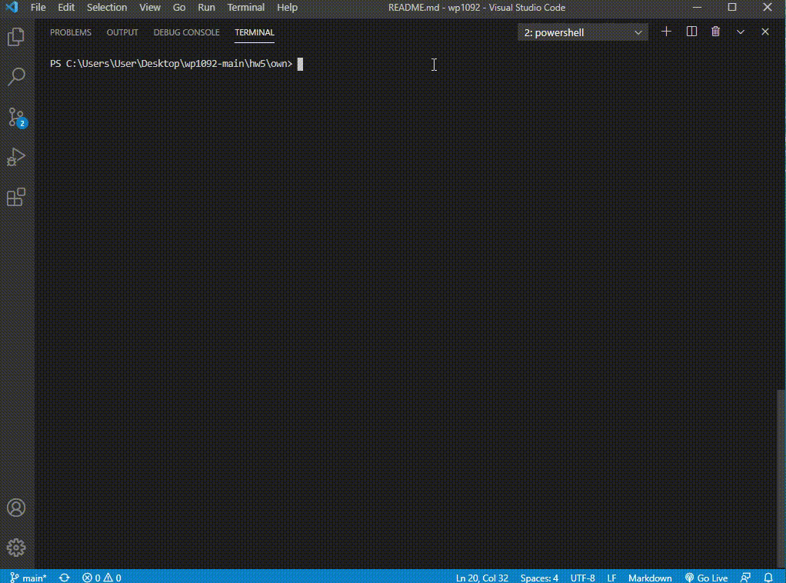

# EE 3035, Web Programming, 109-2
## Practice Homework #5: Backend練習 - Number Guessing Game
### 1. usage
```
$ yarn install
```

- client side
```
$ yarn start
```

- server side (Please open another terminal first)
```
$ yarn server

(Please Note that log files will be generated at ./server/log)
```


### 2. UI/UX improvement
- Add a background image.

- Use bootstrap for css styling.

- If there are continuous two "Bigger" or "Smaller", it will display "Bigger Again" or "Smaller Again" instead of the same word. This can make user know the game is still working.

- Errors will display by alert.

### 3. demo gif
- The following is the demo gif of the client side:


- The following is the demo gif of the server side:



### 4. references
* [Moment.js](https://momentjs.com/)

* [Moment.js cheatsheet](https://devhints.io/moment)

* [Node.js File System Module](https://www.w3schools.com/nodejs/nodejs_filesystem.asp)

* [Day8 - Node.js 檔案系統](https://ithelp.ithome.com.tw/articles/10185422)

* [Node.js v16.0.0 documentation](https://nodejs.org/api/fs.html)

* [Bootstrap](https://getbootstrap.com/docs/4.6/getting-started/introduction/)